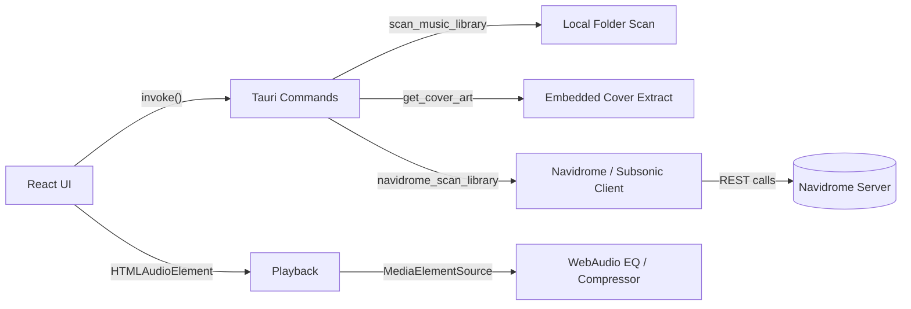

<br />
<div align="center">
  
  
  
  <h3 align="center">Saxon</h3>
  <p align="center">
    A modern, high-performance, and cross-platform music player
    <br />
    <br />
    <a href="#download">Download</a>
    ·
    <a href="#features">Features</a>
    ·
    <a href="#installation">Installation</a>
  </p>
</div>

<details>
  <summary>Table of Contents</summary>
  <ol>
    <li><a href="#about">About</a></li>
    <li><a href="#highlights">Highlights</a></li>
    <li><a href="#features">Features</a></li>
    <li><a href="#providers">Providers</a></li>
    <li><a href="#architecture">Architecture</a></li>
    <li><a href="#download">Download</a></li>
    <li><a href="#installation">Installation</a></li>
    <li><a href="#configuration">Configuration</a></li>
    <li><a href="#development">Development</a></li>
    <li><a href="#tech-stack">Tech Stack</a></li>
  </ol>
</details>

<h1 id="about">About</h1>

- Saxon is a modern music player engineered with **Tauri + Rust** (native backend) and **React + TypeScript** (UI).
- It focuses on a fast, lightweight desktop experience with a responsive dark UI, virtualization for large libraries, and an audio pipeline that supports EQ, normalization, and crossfade.
- Supports both **local libraries** (folder scans) and **Navidrome** (Subsonic API) streaming.

<h1 id="highlights">Highlights</h1>

| Area | What You Get |
|------|--------------|
| Audio | 10-band EQ, presets, crossfade, volume normalization |
| Library | Folder scanning, search, favorites, recents, cover-art caching |
| Performance | Backend scan cache + revision hash + virtualized list rendering |
| Providers | Local library + Navidrome (Subsonic REST API) |
| Platform | Tauri desktop app (Windows/Linux) |

<h1 id="features">Features</h1>

## Audio

| Feature | Description |
|--------|-------------|
| 10-band EQ | Parametric-style EQ bands with presets and custom tuning |
| Crossfade | Smooth transitions with configurable fade duration |
| Normalization | Optional dynamic range compression for consistent loudness |
| WebAudio chain | MediaElement → EQ → Compressor → Master Gain |

## Library & Playback

| Feature | Description |
|--------|-------------|
| Folder scanning | Recursive scan of local music folders (MP3/WAV/OGG/FLAC/M4A/AAC) |
| Cover art | Embedded cover extraction (local) + cover URLs (Navidrome) |
| Fast browsing | Virtualized track list for very large libraries |
| Search | Title/artist/album filtering |
| Favorites | Saved list of tracks for quick access |
| Recents | Recently played tracking with ordering |

## UI/UX

| Feature | Description |
|--------|-------------|
| Dark UI | Minimalist dark-themed interface |
| Frameless window | Custom header + window controls |
| Sidebar navigation | Switch between Library / Now Playing / Favorites / Recent |

<h1 id="providers">Providers</h1>

| Provider | Browse | Stream | Cover Art | Notes |
|---------|--------|--------|----------|------|
| Local folders | ✅ | ✅ | ✅ (embedded tags) | Uses Tauri FS access + tag parsing |
| Navidrome (Subsonic) | ✅ | ✅ | ✅ (`getCoverArt`) | Uses Subsonic REST API (`ping`, `getArtists`, `getAlbum`, `stream`, `getPlaylists`) |

Navidrome library organization:
- Root: **All Tracks**, **Artists**, **Playlists**
- Artists: Artist → Album → Tracks
- Playlists: Playlist → Tracks

<h1 id="architecture">Architecture</h1>

Saxon uses a native Rust backend for filesystem + metadata and exposes commands to the React UI through Tauri.




<h1 id="download">Download</h1>

- Pre-compiled binaries available on the [Releases](https://github.com/kernelstub/Saxon/releases) page
- Windows: `.exe` installer
- Linux: `.deb`, `.rpm`, `.AppImage`

<h1 id="installation">Installation</h1>

## Prerequisites

| Tool | Notes |
|------|------|
| Node.js | LTS recommended |
| Rust | Stable toolchain |
| Windows | Visual Studio C++ Build Tools |
| Linux | WebKit2 GTK + build tools for Tauri |

## Setup

```bash
git clone https://github.com/kernelstub/Saxon.git
cd Saxon
npm install
```

Run in dev:

```bash
npm run tauri dev
```

Build:

```bash
npm run tauri build
```

Build outputs:

| Platform | Output Folder |
|----------|---------------|
| Windows | `src-tauri/target/release/bundle/nsis/` |
| Linux | `src-tauri/target/release/bundle/deb/` and AppImage bundle output |

<h1 id="configuration">Configuration</h1>

Saxon stores configuration in `config.json` inside the app config directory.

| Key | Type | Meaning |
|-----|------|---------|
| `musicFolders` | string[] | Local music folders to scan |
| `favorites` | string[] | Favorite track canonical IDs |
| `recentTracks` | string[] | Recently played track canonical IDs |
| `eqEnabled` | boolean | Enable EQ |
| `eqPreset` | string | EQ preset (`flat`, `bass`, `treble`, etc.) |
| `eqValues` | number[] | 10-band EQ values (0–100) |
| `crossfade` | number | Crossfade seconds |
| `normalize` | boolean | Enable normalization compressor |
| `navidromeServers` | object[] | Saved Navidrome servers (token+salt auth) |

Navidrome server object:

| Field | Meaning |
|------|---------|
| `name` | Display name in the library tree |
| `baseUrl` | Navidrome base URL (e.g. `https://navidrome.example.com`) |
| `username` | Subsonic username |
| `token` / `salt` | Subsonic token auth (derived; password not stored) |
| `enabled` | Toggle server on/off |

<h1 id="development">Development</h1>

## Useful Commands

| Command | What it does |
|--------|---------------|
| `npm run dev` | Starts Vite dev server |
| `npm run build` | Typecheck + build web assets |
| `npm run tauri dev` | Runs the desktop app in dev |
| `npm run tauri build` | Builds desktop bundles |

## Tauri Commands (backend API)

| Command | Purpose |
|--------|---------|
| `scan_music_library(path)` | Scan local folder and return tracks/folders |
| `get_cover_art(path)` | Extract embedded cover art (local) |
| `load_config()` / `save_config(config)` | Persist configuration |
| `navidrome_create_server(...)` | Validate creds and create token+salt server entry |
| `navidrome_test_connection(serverId)` | Ping a configured server |
| `navidrome_scan_library(serverId)` | Fetch library tree/tracks from Navidrome |

<h1 id="tech-stack">Tech Stack</h1>

| Layer | Tech |
|------|------|
| Frontend | React, TypeScript, Tailwind CSS, Radix UI, Lucide |
| Backend | Rust + Tauri 2.x |
| Build | Vite |

